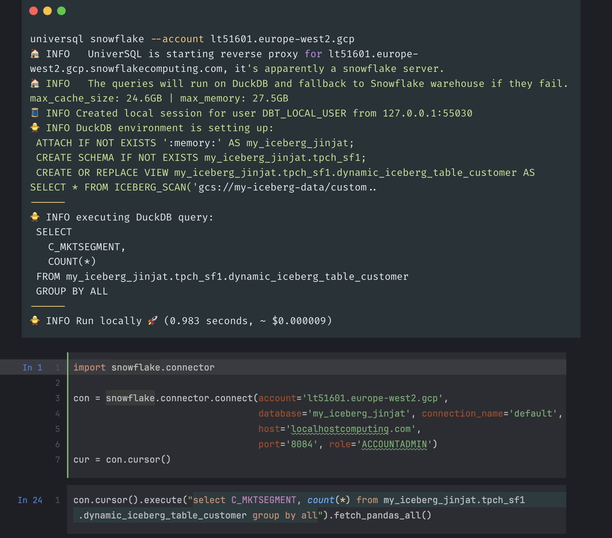

# Execute Snowflake queries locally on DuckDB

UniverSQL is a Snowflake proxy that allows you to run SQL queries **locally** on Snowflake Iceberg tables and Polaris catalog, using DuckDB. 
You can join Snowflake data with your local datasets, **without any need for a running warehouse**.
UniverSQL relies on Snowflake for access control and data catalog so it's complementary to your Snowflake workloads.  

> [!WARNING]  
> Any SQL client that supports Snowflake, also supports UniverSQL as we implement Snowflake's API to support compatibility. If you run into any issue using an app or client, feel free to [create a discussion](https://github.com/buremba/universql/discussions/categories/quality-testing). 
> Universql is not affiliated with Snowflake. 


[](https://www.youtube.com/watch?v=s1fpSEE-pAc)

**[Watch on YouTube](https://www.youtube.com/watch?v=s1fpSEE-pAc)**


# How it works?

* Snowflake SQL API implementation to handle the Snowflake connections, acting as a proxy between DuckDB and Snowflake.
  * You can connect UniverSQL using Snowflake Python Connector, Snowflake JDBC, ODBC or any other Snowflake client.
  * UniverSQL uses Snowflake Arrow integration to fetch the data from Snowflake and convert it to DuckDB relation.
* [SQLGlot](https://sqlglot.com) and [Fakesnow](https://github.com/tekumara/fakesnow) for query translation from Snowflake to DuckDB,
* [Snowflake Iceberg tables](https://docs.snowflake.com/en/user-guide/tables-iceberg) and [Polaris](https://other-docs.snowflake.com/en/polaris/overview) as data catalog, depending on `--account' you proxy to.
* Your local disk for the storage with direct access to data lakes (S3, GCS) for the cloud storage.
* [DuckDB](https://duckdb.org) as local compute engine.

When you query an Iceberg table on Snowflake for the first time, UniverSQL looks up Iceberg metadata from Snowflake, (metadata operation, no compute cost) re-writes the query for DuckDB dialect, 
sets up [filesystem](https://duckdb.org/docs/guides/python/filesystems.html) that connects to your data lake with [your cloud credentials](#install-data-lake-sdks) and caches the Parquet files and executes the query on DuckDB.

# Use Cases

* Smart caching for your Snowflake queries, reducing the compute costs. UniverSQL caches the SQL AST locally and re-uses the cache across multiple runs, better than Snowflake's [result cache](https://docs.snowflake.com/en/user-guide/querying-persisted-results). 
* Query local files without any need to upload them to Snowflake for prototyping and only upload them when you want to share data with your colleagues.
* Utilize your hardware for running queries faster on small datasets and run queries on your data even when you don't have internet connectivity.
* Develop end-user facing applications on top Snowflake, using DuckDB to query the data.
* Use DuckDB warehouse for managed and on-premise Polaris Catalog.

# Getting Started

### Python

```bash
python3 -m pip install universql
```

#### Using virtual environments

We recommend using virtual environments (venv) to namespace pip modules. Create a new venv as follows:

```bash
python -m venv universql-env              # create the environment
```

Activate that same virtual environment each time you create a shell window or session:

```
source universql-env/bin/activate         # activate the environment for Mac and Linux OR
universql-env\Scripts\activate            # activate the environment for Windows
```

### Docker

Alternatively, pull the Docker image: (recommended for running in background)

```bash
docker pull buremba/universql
```

And then:

```bash
universql 
  --network=host \
  --mount type=bind,source=<>,target=/usr/app \
    snowflake --account-url lt51601.europe-west2.gcp
```

For Docker:

```bash
docker run buremba/universql snowflake --account eq06461.eu-west-2.aws
```

# CLI

```
> universql snowflake --help

Usage: universql snowflake [OPTIONS]

Options:
  --account TEXT                  The account to use. Supports both Snowflake
                                  and Polaris (ex: rt21601.europe-west2.gcp)
  --port INTEGER                  Port for Snowflake proxy server (default:
                                  8084)
  --host TEXT                     Host for Snowflake proxy server (default:
                                  localhostcomputing.com)
  --compute [local|auto|snowflake]
                                  Enforce the query execution layer (default:
                                  auto, try with DuckDB and use Snowflake if
                                  it fails)
  --catalog [snowflake|polaris]   Type of the Snowflake account. Automatically
                                  detected if not provided.
  --aws-profile TEXT              AWS profile to access S3 (default:
                                  `default`)
  --gcp-project TEXT              GCP project to access GCS and apply quota.
                                  (to see how to setup auth for GCP and use
                                  different accounts, visit https://cloud.goog
                                  le.com/docs/authentication/application-
                                  default-credentials)
  --ssl_keyfile TEXT              SSL keyfile for the proxy server, optional.
                                  Use it if you don't want to use
                                  localhostcomputing.com
  --ssl_certfile TEXT             SSL certfile for the proxy server, optional.
  --max-memory TEXT               DuckDB Max memory to use for the server
                                  (default: 80% of total memory)
  --cache-directory TEXT          Data lake cache directory (default:
                                  ~/.universql/cache)
  --max-cache-size TEXT           DuckDB maximum cache used in local disk
                                  (default: 80% of total available disk)
  --help                          Show this message and exit.
```

# Access to Storage

### Polaris

Polaris Catalog is a managed Iceberg table catalog that is available in Snowflake.
It manages access credentials to data lake and the metadata of the Iceberg tables.
If your Snowflake account (`snowflake --account`) is a Polaris Catalog, UniverSQL will use PyIceberg to fetch data from your data lake and map them as Arrow tables in DuckDB.

### Snowflake

Since Snowflake doesn't provide direct access to data lake, UniverSQL uses your local credentials for cloud storage so [make sure you configure the cloud SDKs](#install-data-lake-sdks).
You should install the your cloud's SDK and configure it with your credentials.

###### AWS

[Install](https://docs.aws.amazon.com/cli/latest/userguide/getting-started-install.html) and [configure](https://docs.aws.amazon.com/cli/latest/userguide/cli-configure-sso.html#sso-configure-profile-token-auto-sso) AWS CLI.
If you would like to use AWS client id / secret, you can use `aws configure` to set them up.
By default, UniverSQL uses your default AWS profile, you can pass `--aws-profile` option to `universql` to use a different profile than the default profile.

###### Google Cloud

[Install](https://cloud.google.com/sdk/docs/initializing) and [configure](https://cloud.google.com/sdk/docs/authorizing) Google Cloud SDK. You can use `gcloud auth application-default login` to login with your Google Cloud account.
By default, UniverSQL uses your default GCP account attached to `gcloud`, you can pass `--gcp-account` option to `universql` to use a different profile than the default account.

###### Azure

[Install](https://learn.microsoft.com/en-us/cli/azure/install-azure-cli) and [configure](https://learn.microsoft.com/en-us/cli/azure/authenticate-azure-cli-interactively) Azure CLI.
By default, UniverSQL uses [your default Azure tenant](https://learn.microsoft.com/en-us/cli/azure/manage-azure-subscriptions-azure-cli?tabs=bash#change-the-active-tenant) attached to `az`, you can pass `--azure-tenant` option to `universql` to use a different profile than the default account.

## Compute Strategies

`auto` (default): Best effort to run the query locally, with the fallback option to run it on Snowflake.

`local`: Runs the queries locally and on Snowflake only if it doesn't require a running warehouse. Useful for spinning up local test environments.

`snowflake`: Runs the queries directly on Snowflake as passthrough. Useful for rewriting and blocking queries on the fly based on specific rules or re-routing warehouses based on custom logic.

# Limitations

## Be aware of trade-offs

UniverSQL is designed to be a complementary tool that helps you utilize local hardware when using Snowflake, for small datasets that you're working on locally.

### Cost

The virtual warehouse concept is great for running large queries on large datasets but usually X-Small works OK for running ad-hoc queries on small datasets that has < 2B rows.
X-Small warehouse costs $2/hour and is [likely](https://stackoverflow.com/questions/58973007/what-are-the-specifications-of-a-snowflake-server) using [m5.2xlarge](https://instances.vantage.sh/aws/ec2/m5.2xlarge).
If your query runs on X-Small warehouse, it will likely run to run your computer if you have 8GB - 32GB memory.

If you're the one executing the Snowflake queries and your computer has enough resources, the compute is free for you. 
You will only **need to pay for the egress network costs** from your cloud provider but it's going to be much cheaper than running a warehouse on Snowflake.

### Performance

UniverSQL uses DuckDB as the local compute engine, which is a columnar database that is optimized for analytical queries. The queries that fit in your memory will mostly run under a second but for larger queries, the performance is comparable to Snowflake up to a certain point, depending on your hardware.
On Macbook Pro M2 2023, the performance is comparable to Snowflake up to 2B rows.

[](https://benchmark.clickhouse.com/#eyJzeXN0ZW0iOnsiQWxsb3lEQiI6ZmFsc2UsIkF0aGVuYSAocGFydGl0aW9uZWQpIjpmYWxzZSwiQXRoZW5hIChzaW5nbGUpIjpmYWxzZSwiQXVyb3JhIGZvciBNeVNRTCI6ZmFsc2UsIkF1cm9yYSBmb3IgUG9zdGdyZVNRTCI6ZmFsc2UsIkJ5Q29uaXR5IjpmYWxzZSwiQnl0ZUhvdXNlIjpmYWxzZSwiY2hEQiAoUGFycXVldCwgcGFydGl0aW9uZWQpIjpmYWxzZSwiY2hEQiI6ZmFsc2UsIkNpdHVzIjpmYWxzZSwiQ2xpY2tIb3VzZSBDbG91ZCAoYXdzKSI6ZmFsc2UsIkNsaWNrSG91c2UgQ2xvdWQgKGF3cykgUGFyYWxsZWwgUmVwbGljYXMgT04iOmZhbHNlLCJDbGlja0hvdXNlIENsb3VkIChBenVyZSkiOmZhbHNlLCJDbGlja0hvdXNlIENsb3VkIChBenVyZSkgUGFyYWxsZWwgUmVwbGljYSBPTiI6ZmFsc2UsIkNsaWNrSG91c2UgQ2xvdWQgKEF6dXJlKSBQYXJhbGxlbCBSZXBsaWNhcyBPTiI6ZmFsc2UsIkNsaWNrSG91c2UgQ2xvdWQgKGdjcCkiOmZhbHNlLCJDbGlja0hvdXNlIENsb3VkIChnY3ApIFBhcmFsbGVsIFJlcGxpY2FzIE9OIjpmYWxzZSwiQ2xpY2tIb3VzZSAoZGF0YSBsYWtlLCBwYXJ0aXRpb25lZCkiOmZhbHNlLCJDbGlja0hvdXNlIChkYXRhIGxha2UsIHNpbmdsZSkiOmZhbHNlLCJDbGlja0hvdXNlIChQYXJxdWV0LCBwYXJ0aXRpb25lZCkiOmZhbHNlLCJDbGlja0hvdXNlIChQYXJxdWV0LCBzaW5nbGUpIjpmYWxzZSwiQ2xpY2tIb3VzZSAod2ViKSI6ZmFsc2UsIkNsaWNrSG91c2UiOmZhbHNlLCJDbGlja0hvdXNlICh0dW5lZCkiOmZhbHNlLCJDbGlja0hvdXNlICh0dW5lZCwgbWVtb3J5KSI6ZmFsc2UsIkNsb3VkYmVycnkiOmZhbHNlLCJDcmF0ZURCIjpmYWxzZSwiRGF0YWJlbmQiOmZhbHNlLCJEYXRhRnVzaW9uIChQYXJxdWV0LCBwYXJ0aXRpb25lZCkiOmZhbHNlLCJEYXRhRnVzaW9uIChQYXJxdWV0LCBzaW5nbGUpIjpmYWxzZSwiQXBhY2hlIERvcmlzIjpmYWxzZSwiRHJ1aWQiOmZhbHNlLCJEdWNrREIgKFBhcnF1ZXQsIHBhcnRpdGlvbmVkKSI6dHJ1ZSwiRHVja0RCIjpmYWxzZSwiRWxhc3RpY3NlYXJjaCI6ZmFsc2UsIkVsYXN0aWNzZWFyY2ggKHR1bmVkKSI6ZmFsc2UsIkdsYXJlREIiOmZhbHNlLCJHcmVlbnBsdW0iOmZhbHNlLCJIZWF2eUFJIjpmYWxzZSwiSHlkcmEiOmZhbHNlLCJJbmZvYnJpZ2h0IjpmYWxzZSwiS2luZXRpY2EiOmZhbHNlLCJNYXJpYURCIENvbHVtblN0b3JlIjpmYWxzZSwiTWFyaWFEQiI6ZmFsc2UsIk1vbmV0REIiOmZhbHNlLCJNb25nb0RCIjpmYWxzZSwiTW90aGVyZHVjayI6ZmFsc2UsIk15U1FMIChNeUlTQU0pIjpmYWxzZSwiTXlTUUwiOmZhbHNlLCJPeGxhIjpmYWxzZSwiUGFyYWRlREIgKFBhcnF1ZXQsIHBhcnRpdGlvbmVkKSI6ZmFsc2UsIlBhcmFkZURCIChQYXJxdWV0LCBzaW5nbGUpIjpmYWxzZSwiUGlub3QiOmZhbHNlLCJQb3N0Z3JlU1FMICh0dW5lZCkiOmZhbHNlLCJQb3N0Z3JlU1FMIjpmYWxzZSwiUXVlc3REQiAocGFydGl0aW9uZWQpIjpmYWxzZSwiUXVlc3REQiI6ZmFsc2UsIlJlZHNoaWZ0IjpmYWxzZSwiU2VsZWN0REIiOmZhbHNlLCJTaW5nbGVTdG9yZSI6ZmFsc2UsIlNub3dmbGFrZSI6dHJ1ZSwiU1FMaXRlIjpmYWxzZSwiU3RhclJvY2tzIjpmYWxzZSwiVGFibGVzcGFjZSI6ZmFsc2UsIlRlbWJvIE9MQVAgKGNvbHVtbmFyKSI6ZmFsc2UsIlRpbWVzY2FsZURCIChjb21wcmVzc2lvbikiOmZhbHNlLCJUaW1lc2NhbGVEQiI6ZmFsc2UsIlVtYnJhIjpmYWxzZX0sInR5cGUiOnsiQyI6dHJ1ZSwiY29sdW1uLW9yaWVudGVkIjp0cnVlLCJQb3N0Z3JlU1FMIGNvbXBhdGlibGUiOnRydWUsIm1hbmFnZWQiOnRydWUsImdjcCI6dHJ1ZSwic3RhdGVsZXNzIjp0cnVlLCJKYXZhIjp0cnVlLCJDKysiOnRydWUsIk15U1FMIGNvbXBhdGlibGUiOnRydWUsInJvdy1vcmllbnRlZCI6dHJ1ZSwiQ2xpY2tIb3VzZSBkZXJpdmF0aXZlIjp0cnVlLCJlbWJlZGRlZCI6dHJ1ZSwic2VydmVybGVzcyI6dHJ1ZSwiYXdzIjp0cnVlLCJwYXJhbGxlbCByZXBsaWNhcyI6dHJ1ZSwiQXp1cmUiOnRydWUsIlJ1c3QiOnRydWUsInNlYXJjaCI6dHJ1ZSwiZG9jdW1lbnQiOnRydWUsImFuYWx5dGljYWwiOnRydWUsInNvbWV3aGF0IFBvc3RncmVTUUwgY29tcGF0aWJsZSI6dHJ1ZSwidGltZS1zZXJpZXMiOnRydWV9LCJtYWNoaW5lIjp7IjE2IHZDUFUgMTI4R0IiOnRydWUsIjggdkNQVSA2NEdCIjp0cnVlLCJzZXJ2ZXJsZXNzIjp0cnVlLCIxNmFjdSI6dHJ1ZSwiYzZhLjR4bGFyZ2UsIDUwMGdiIGdwMiI6dHJ1ZSwiTCI6dHJ1ZSwiTSI6dHJ1ZSwiUyI6dHJ1ZSwiWFMiOnRydWUsImM2YS5tZXRhbCwgNTAwZ2IgZ3AyIjp0cnVlLCIxOTJHQiI6dHJ1ZSwiMjRHQiI6dHJ1ZSwiMzYwR0IiOnRydWUsIjQ4R0IiOnRydWUsIjcyMEdCIjp0cnVlLCI5NkdCIjp0cnVlLCIxNDMwR0IiOnRydWUsImRldiI6dHJ1ZSwiNzA4R0IiOnRydWUsImM1bi40eGxhcmdlLCA1MDBnYiBncDIiOnRydWUsImM1LjR4bGFyZ2UsIDUwMGdiIGdwMiI6dHJ1ZSwiYzZhLjR4bGFyZ2UsIDE1MDBnYiBncDIiOnRydWUsImNsb3VkIjp0cnVlLCJkYzIuOHhsYXJnZSI6dHJ1ZSwicmEzLjE2eGxhcmdlIjp0cnVlLCJyYTMuNHhsYXJnZSI6dHJ1ZSwicmEzLnhscGx1cyI6dHJ1ZSwiUzIiOnRydWUsIlMyNCI6dHJ1ZSwiMlhMIjp0cnVlLCIzWEwiOnRydWUsIjRYTCI6dHJ1ZSwiWEwiOnRydWUsIkwxIC0gMTZDUFUgMzJHQiI6dHJ1ZSwiYzZhLjR4bGFyZ2UsIDUwMGdiIGdwMyI6dHJ1ZSwiQW5hbHl0aWNzLTI1NkdCICg2NCB2Q29yZXMsIDI1NiBHQikiOnRydWV9LCJjbHVzdGVyX3NpemUiOnsiMSI6dHJ1ZSwiMiI6dHJ1ZSwiNCI6ZmFsc2UsIjgiOmZhbHNlLCIxNiI6ZmFsc2UsIjMyIjpmYWxzZSwiNjQiOmZhbHNlLCIxMjgiOmZhbHNlLCJzZXJ2ZXJsZXNzIjpmYWxzZSwiZGVkaWNhdGVkIjpmYWxzZX0sIm1ldHJpYyI6ImhvdCIsInF1ZXJpZXMiOlt0cnVlLHRydWUsdHJ1ZSx0cnVlLHRydWUsdHJ1ZSx0cnVlLHRydWUsdHJ1ZSx0cnVlLHRydWUsdHJ1ZSx0cnVlLHRydWUsdHJ1ZSx0cnVlLHRydWUsdHJ1ZSx0cnVlLHRydWUsdHJ1ZSx0cnVlLHRydWUsdHJ1ZSx0cnVlLHRydWUsdHJ1ZSx0cnVlLHRydWUsdHJ1ZSx0cnVlLHRydWUsdHJ1ZSx0cnVlLHRydWUsdHJ1ZSx0cnVlLHRydWUsdHJ1ZSx0cnVlLHRydWUsdHJ1ZSx0cnVlXX0=)

### Latency

The latency relies on your network bandwidth. Your local disk is used for caching the data in a data lake and the cache is populated lazily as you query the data and persists across multiple runs.
Cold runs will likely be slower than running the query on Snowflake as the data needs to be downloaded from the data lake with UniverSQL whereas Snowflake runs the compute in the same cloud region.

The subsequent queries (hot run) on the same table will be served from the cache. If the Iceberg table is updated, only the new data is downloaded from the data lake. 
The same data is never downloaded more than once.
Iceberg supports predicate pushdown, which helps with partitioned tables to reduce the amount of data downloaded for partitioned tables.

## Signed certificates are required in Snowflake SQL V1 API

Snowflake V1 API requires a valid CA certificate, which is [not possible with self-signed certificates](https://letsencrypt.org/docs/certificates-for-localhost/). 

If you don't need to expose UniverSQL to the public internet with a public tunnel service, UniverSQL ships SSL certificate of [localhostcomputing.com](https://localhostcomputing.com) domain in the binary, which has [DNS record to 127.0.0.1](https://mxtoolbox.com/SuperTool.aspx?action=a%3alocalhostcomputing.com&run=toolpage). 
It gives you free https connection to your local server and it's the default host. 

> [!NOTE] 
> Your data doesn't go through an external server with this approach as the DNS resolves to your localhost. Using `localhostcomputing.com` will save you from the hassle of setting up a self-signed or CA-trusted certificates.
> 
> If you would like to use localhost (or `127.0.0.1`) directly, you can install [mkcert](https://github.com/FiloSottile/mkcert) to have a self-signed certificate for localhost and use `--ssl_keyfile` and `--ssl_certfile` options to pass the certificate and key files.

## Can't query native Snowflake tables locally

UniverSQL doesn't support querying native Snowflake tables as they're not accessible from outside of Snowflake. If you try to query a Snowflake table directly, it will return an error.
For Catalog, [Snowflake](https://docs.snowflake.com/en/sql-reference/sql/create-iceberg-table-snowflake) and [Object Store](https://docs.snowflake.com/en/sql-reference/sql/create-iceberg-table-iceberg-files) catalogs are supported at the moment.
For Data lake, S3 and GCS supported.

 ```sql
    SELECT * FROM my_snowflake_table;
```

You have two alternatives:

1. Create a dynamic iceberg table replicating your native Snowflake table. This approach requires a warehouse but the usage will be minimal as dynamic tables are serverless, with the caveat of having some lag provided in `TARGET_LAG` option. 

 ```sql
 CREATE DYNAMIC ICEBERG TABLE my_iceberg_snowflake_table 
   TARGET_LAG = '1 hour'  WAREHOUSE = 'compute_xs'
    CATALOG = 'SNOWFLAKE'
    EXTERNAL_VOLUME = 'your_data_lake_volume'
    BASE_LOCATION = 'my_transformed_table'
    REFRESH_MODE = auto
    INITIALIZE = on_create
 AS SELECT * FROM my_snowflake_table;
```
Dynamic tables are the recommended approach **if your native tables have more than 1B+ of rows** so that you can filter/aggregate them before pulling them into your local environment. If your native tables are small enough, consider switching them to Iceberg from Native.

2. You can use `to_query` function to run queries directly in Snowflake and return the result as a table. You can join native Snowflake table with your local files as follows: 

```sql
SELECT * FROM table(to_query('select col1 from my_snowflake_table')) where col1 = 2
```

UniverSQL doesn't actually require you to create the `to_query` function in your Snowflake database. When you use the proxy server, it will create a query plan to execute your Snowflake query first and map the result as an Arrow table in DuckDB. 
This approach is recommended for hybrid execution where you need to query your native Snowflake tables on the fly. 

## Only read-only `SELECT` queries can use local warehouse.

Since UniverSQL uses SQLGlot for parsing Snowflake queries and it supports most of the Snowflake syntax. 
* In the cases where we can't parse the query, we can't run the query locally. If you run into such case, please open an issue with the query. You can use `--passthrough` option when starting the proxy server to run the query in Snowflake if it can't be parsed. That way you can make sure your client applications don't break.
* Anything except `SELECT` query is directly executed in your target Snowflake account. That way, your changes (including `CREATE TABLE`) are visible to all other Snowflake users.

## You need a tunnel service to connect from external tools
If your local computer is not accessible from public network, (i.e. no external IP) external tools such as notebooks (Hex, Google Colab etc.) and BI tools (Tableau Online, Looker, Mode etc.) can't connect UniverSQL. 
The workaround is to use a public tunnel service to expose your local server to the internet. Here are some options:

* [Cloudflare Tunnel](https://developers.cloudflare.com/cloudflare-one/connections/connect-networks/do-more-with-tunnels/trycloudflare/) (recommended)
* [ngrok](https://ngrok.com/)

## No support for Snowflake SQL V2 API yet

While SQL V1 API is internal, most Snowflake clients are using SQL V1 API, including JDBC, Python, ODBC etc. Feel free to help support [SQL V2 API](https://docs.snowflake.com/en/developer-guide/sql-api/intro) by contributing to the project. It should be easy enough as we already use Arrow interface for the V1 API, which is the interface for V2.

